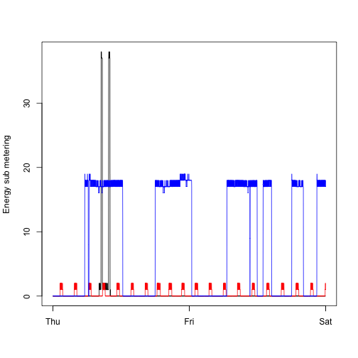

For the convenience of peer reviews
========================================================
_This document is created by Yuantao Wang with the help of RMarkdown and the knitr library._  
_You can also click [here](https://dl.dropboxusercontent.com/s/n4twmi17ah89jen/class4pj1.html) for better view of this document._
### A NOTE for peer reviewers:
#### Please make sure the _household_power_consumption.txt_ is currently located in the working directory.

### __Fig1__
__Read in the data of July 1st - 2nd by pipe and egrep function (General Expression).__

```r
ge <- "egrep '^Date|^[1-2]/2/2007' household_power_consumption.txt"
consumption <- read.table(pipe(ge), header = T, sep = ";")
```


__Create a histogram of global active power on screen device.__

```r
hist(consumption$Global_active_power, xlab = "Global Active Power (kilowatts)", 
    ylab = "Frequency", main = "Global Active Power", col = "red")
```

 


__Copy the plot to a PNG file with a width of 480 pixels and a height of 480 pixels.__

```r
dev.copy(png, file = "plot1.png", width = 480, height = 480)
```


__Close the PNG device.__

```r
dev.off()
```


### __Fig2__
__Paste date and time together and coerce them into POSIXlt.__

```r
date_list <- as.character(consumption$Date)
time_list <- as.character(consumption$Time)
Time_list <- paste(date_list, time_list)
Time_as_date <- strptime(Time_list, "%d/%m/%Y %H:%M:%S")
```


__Create a df contains the time and gap data only.__

```r
Global_active_power <- consumption$Global_active_power
df <- data.frame(Time_as_date, Global_active_power)
```


__Create a plot of global active power on screen device.__

```r
plot(df$Time_as_date, df$Global_active_power, type = "l", xlab = "", ylab = "Global Active Power (kilowatts)")
```

 


__Copy the plot to a PNG file with a width of 480 pixels and a height of 480 pixels.__

```r
dev.copy(png, file = "plot2.png", width = 480, height = 480)
```


__Close the PNG device.__

```r
dev.off()
```


### __Fig3__

__Create a df contains time and metering data only.__

```r
df <- data.frame(Time_as_date, consumption[, c(7, 8, 9)])
```


__Create a plot of Energy sub metering to date on screen device,__ __Create legend on the topright.__

```r

plot(df$Time_as_date, df$Sub_metering_1, type = "l", col = "black", xlab = "", 
    ylab = "Energy sub metering")
lines(df$Time_as_date, df$Sub_metering_2, type = "l", col = "red")
lines(df$Time_as_date, df$Sub_metering_3, type = "l", col = "blue")

legend("topright", lty = 1, col = c("black", "red", "blue"), legend = c("Sub_metering_1", 
    "Sub_metering_2", "Sub_metering_3"))
```

 


__Copy the plot to a PNG file with a width of 480 pixels and a height of 480 pixels.__

```r
dev.copy(png, file = "plot3.png", width = 480, height = 480)
```


__Close the PNG device.__

```r
dev.off()
```


### __Fig4__

__Create a df contains time and required data for plotting.__

```r
df <- data.frame(Time_as_date, consumption[, c(3, 4, 5, 7, 8, 9)])
```


__Create 4 seperate plots on the same screen device.__

```r
par(mfrow = c(2, 2), mar = c(4, 4, 0.5, 1), ps = 12, cex = 1, cex.axis = 0.85, 
    cex.lab = 0.85)

## plot1
plot(df$Time_as_date, df$Global_active_power, type = "l", xlab = "", ylab = "Global Active Power")

## plot2
plot(df$Time_as_date, df$Voltage, type = "l", xlab = "datetime", ylab = "Voltage")

## plot3
plot(df$Time_as_date, df$Sub_metering_1, type = "l", col = "black", xlab = "", 
    ylab = "Energy sub metering")
lines(df$Time_as_date, df$Sub_metering_2, type = "l", col = "red")
lines(df$Time_as_date, df$Sub_metering_3, type = "l", col = "blue")
legend("topright", lty = 1, col = c("black", "red", "blue"), legend = c("Sub_metering_1", 
    "Sub_metering_2", "Sub_metering_3"), bty = "n", cex = 0.6)

## plot4
plot(df$Time_as_date, df$Global_reactive_power, type = "l", xlab = "datetime", 
    ylab = "Global_reactive_power")
```

 


__Copy the plot to a PNG file with a width of 480 pixels and a height of 480 pixels.__

```r
dev.copy(png, file = "plot4.png", width = 480, height = 480)
```


__Close the PNG device.__

```r
dev.off()
```

